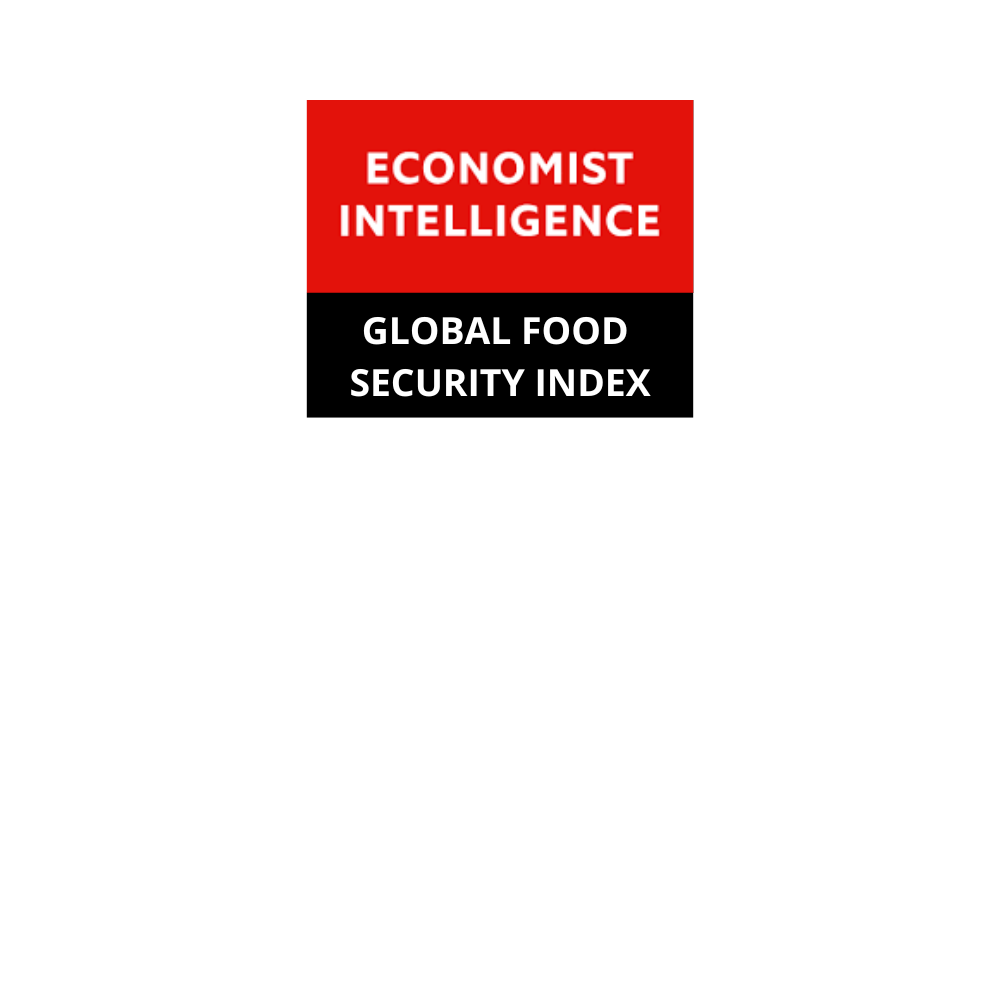
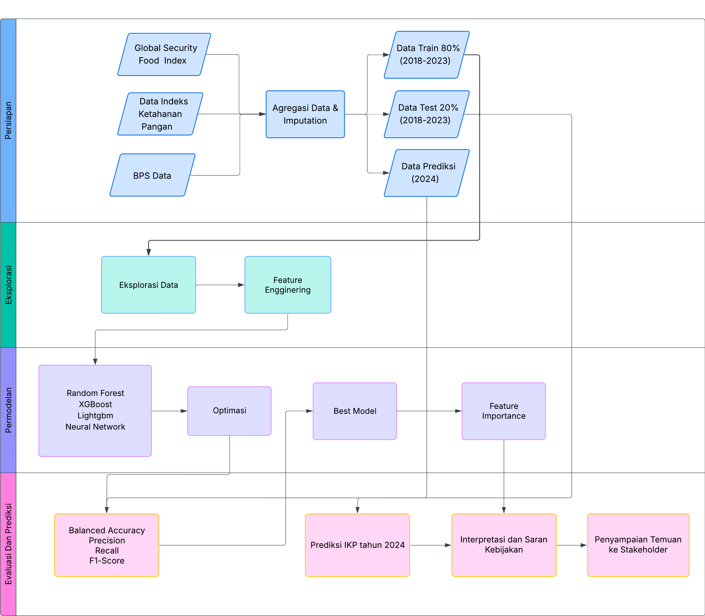
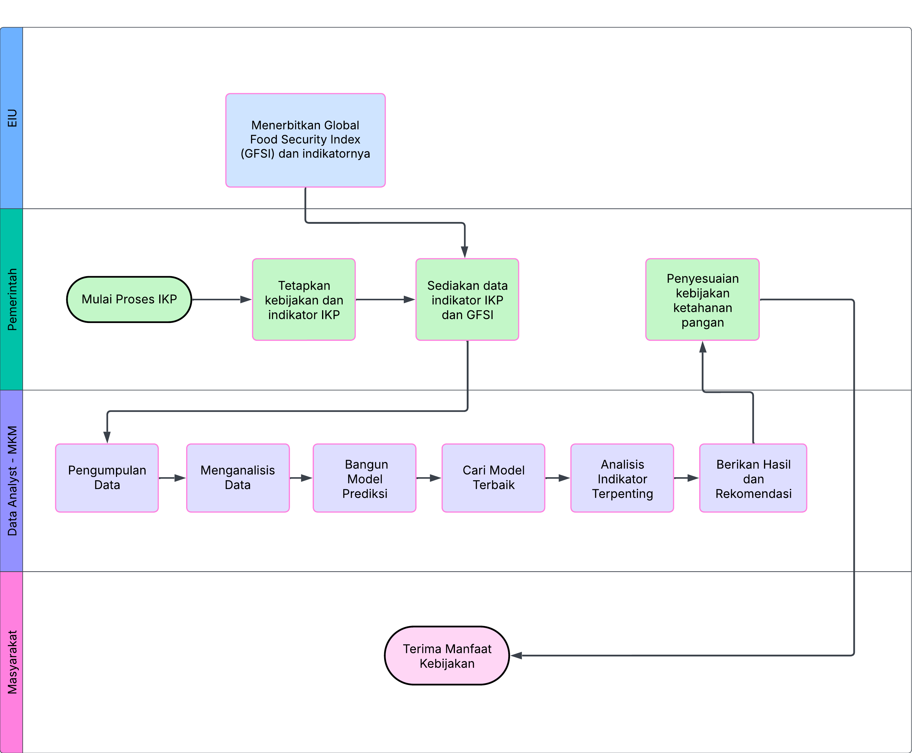

<!DOCTYPE html>
<html lang="id">
<head>
  <meta charset="UTF-8">
  <meta name="viewport" content="width=device-width, initial-scale=1.0">
</head>
<body>
<header>
  <h1>🌾 Data-Driven Prediction of Food Security Index Categories in Indonesia Using Machine Learning and GFSI-BPN Indicators
</h1>
  
  
Proyek ini bertujuan untuk membangun model prediksi kategori Indeks Ketahanan Pangan (IKP) kabupaten/kota di Indonesia. Model dikembangkan dengan memanfaatkan 9 indikator utama dari Badan Pangan Nasional (BPN) dan indikator tambahan dari Global Food Security Index (GFSI) serta variabel sosial-ekonomi lainnya. Diharapkan model ini mampu memberikan insight berbasis data yang akurat untuk mendukung kebijakan ketahanan pangan nasional.

</header>

<h2>🇮🇩 Latar Belakang</h2> 

 <em>Indeks Ketahanan Pangan di Indonesia</em>

Ketahanan pangan merupakan isu strategis dalam pembangunan berkelanjutan Indonesia. World Food Summit (1996) mendefinisikan ketahanan pangan sebagai:

<blockquote><em>“Situasi di mana setiap orang, setiap saat, memiliki akses fisik dan ekonomi terhadap pangan yang cukup, aman, dan bergizi untuk menjalani kehidupan yang sehat.”</em></blockquote>

Food Security Index (FSI) atau Indeks Ketahanan Pangan (IKP) menilai kemampuan negara dalam menjamin ketersediaan, akses, dan pemanfaatan pangan. Menurut Global Food Security Index (2022), Indonesia menempati peringkat 63 dari 113 negara.

<h2>🎯 Tujuan Penelitian</h2> 
<ul>
  <li>Mengidentifikasi faktor utama ketahanan pangan Indonesia</li>
  <li>Menyeleksi variabel yang relevan untuk model prediksi IKP</li>
  <li>Membangun model prediksi berbasis Neural Network + GFSI</li>
  <li>Memprediksi IKP kabupaten/kota untuk tahun 2024-2025</li>
</ul>

<h2>📋 Data dan Variabel</h2>

  <table>
  <tr>
    <td align="center">
       
      <strong>Satudata Indonesia</strong>
    </td>
    <td align="center">
       
      <strong>Badan Pusat Statistik</strong>
    </td>
    <td align="center">
       
      <strong>Global Food Safety Initiative</strong>
    </td>
  </tr>
</table>

<h3><strong>Variabel Prediktor (X):</strong></h3>
<h4>Indikator Sosial dan Kesehatan</h4>
<ul>
  <li>Angka Harapan Hidup</li>
  <li>Rasio Tenaga Kesehatan</li>
  <li>Stunting (%)</li>
  <li>Tanpa Air Bersih (%)</li>
</ul>

<h4>Indikator Pendidikan</h4>
<ul>
  <li>Rata-rata Lama Sekolah Laki-laki</li>
  <li>Rata-rata Lama Sekolah Perempuan</li>
</ul>

<h4>Kemiskinan dan Ekonomi</h4>
<ul>
  <li>Garis Kemiskinan</li>
  <li>Jumlah Penduduk Miskin</li>
  <li>Kemiskinan (%)</li>
  <li>Persentase Penduduk Miskin</li>
  <li>Indeks Kedalaman Kemiskinan</li>
  <li>Indeks Keparahan Kemiskinan</li>
  <li>Indeks Pembangunan Manusia</li>
  <li>Prevalensi Konsumsi Pangan Tidak Cukup</li>
</ul>

<h4>Pengeluaran Konsumsi Pangan</h4>
<ul>
  <li>Pengeluaran Pangan (%)</li>
  <li>Pengeluaran Perkapita Padi-Padian</li>
  <li>Pengeluaran Perkapita Umbi-Umbian</li>
  <li>Pengeluaran Perkapita Kacang-Kacangan</li>
  <li>Pengeluaran Perkapita Buah-Buahan</li>
  <li>Pengeluaran Perkapita Telur dan Susu</li>
  <li>Pengeluaran Perkapita Daging</li>
  <li>Pengeluaran Perkapita Bahan Minuman</li>
  <li>Pengeluaran Perkapita Bahan Makanan Lainnya</li>
  <li>Pengeluaran Perkapita Bahan Minyak dan Kelapa</li>
  <li>Pengeluaran Perkapita Rokok dan Tembakau</li>
</ul>

<h4>Indeks Konsumsi Pangan</h4>
<ul>
  <li>NCPR</li>
</ul>

<strong>Variabel Target (Y):</strong> Kategori IKP disederhanakan menjadi 0 (Rentan: 1–3) & 1 (Tahan: 4–6)

<h2>💡 Metodologi</h2>

 <em>Gambar 1. Flowchart Metode Indeks Ketahanan Pangan</em>

<h2>🧭 Tahapan Penelitian IKP</h2>

<h3>1️⃣ Persiapan Data</h3>
<ul>
  <li>Mengintegrasikan sumber data dari:
    <ul>
      <li>Global Food Security Index (GFSI)</li>
      <li>Indeks Ketahanan Pangan</li>
      <li>Data Sosial-Ekonomi BPS</li>
    </ul>
  </li>
  <li>Melakukan agregasi data dan imputasi nilai hilang</li>
  <li>Membagi dataset menjadi:
    <ul>
      <li>Data Train (2018–2022)</li>
      <li>Data Test (2023)</li>
      <li>Data Prediksi (2024)</li>
    </ul>
  </li>
</ul>

<h3>2️⃣ Eksplorasi Data</h3>
<ul>
  <li>Analisis eksploratif (EDA) terhadap distribusi dan korelasi variabel</li>
  <li>Melakukan feature engineering untuk variabel-variabel baru</li>
</ul>

<h3>3️⃣ Pemodelan</h3>
<ul>
  <li>Membangun model klasifikasi menggunakan:
    <ul>
      <li>Random Forest</li>
      <li>XGBoost</li>
      <li>LightGBM</li>
      <li>Neural Network</li>
    </ul>
  </li>
  <li>Melakukan optimasi parameter menggunakan Grid Search</li>
  <li>Menentukan model terbaik berdasarkan metrik evaluasi</li>
  <li>Analisis kontribusi fitur (feature importance)</li>
</ul>

<h3>4️⃣ Evaluasi dan Prediksi</h3>
<ul>
  <li>Mengukur performa model dengan:
    <ul>
      <li>Accuracy</li>
      <li>Balanced Accuracy</li>
      <li>Precision, Recall, dan F1-Score</li>
    </ul>
  </li>
  <li>Prediksi kategori IKP kabupaten/kota tahun 2024</li>
  <li>Interpretasi hasil dan penyusunan rekomendasi kebijakan</li>
  <li>Persiapan untuk diseminasi hasil melalui kunjungan ke Badan Pangan Nasional (BPN)</li>
</ul>

<h2>📋 Diagram Alur Proyek</h2>

 <em>Gambar 2. WorkFlow Indeks Ketahanan Pangan/Kota</em>

<h2>🚀 Fitur</h2>
<ol>
  <li>Identifikasi faktor-faktor baru yang memengaruhi IKP di luar 9 indikator resmi BPN</li>
  <li>Pembangunan model prediksi kategori IKP dengan berbagai algoritma machine learning</li>
  <li>Visualisasi hasil klasifikasi dan eksplorasi IKP</li>
</ol>

<h2>📂 Struktur Proyek</h2>
<pre>
mkmsml/
├── WorkFlow/
│ └── img/ # Visualisasi alur kerja dan ilustrasi proses
├── data/
│ ├── Data Raw/ # Dataset mentah sebelum praproses
│ └── Data Clean/ # Dataset hasil pembersihan dan imputasi
├── grid/ # Hasil tuning hyperparameter (grid search output)
├── img/ # Gambar tambahan
├── model/ # Model hasil pelatihan
├── script/
│ ├── Skrip EDA.ipynb # Eksplorasi Data Awal
│ ├── Script Modeling.ipynb # Pelatihan model
│ ├── Skrip Rapihkan Data...ipynb # Notebook untuk cleaning dan imputasi
│ └── run_model_cli.py # Script CLI untuk menjalankan prediksi
├── shp file/BATAS KABUPATEN KOTA/ # Shapefile batas administratif wilayah
├── LICENSE.txt # Lisensi proyek
└── README.md # Dokumentasi proyek ini
</pre>

<h2>Evaluasi Model Terbaik: LightGBM-Tuned - ADASYN</h2>

<pre>
Confusion Matrix:
[[525   2]
 [  3  87]]

Accuracy           : 0.9919
Balanced Accuracy  : 0.9814

Precision (Pos=1)  : 0.9943 | Weighted: 0.9919 | Macro: 0.9859
Recall    (Pos=1)  : 0.9962 | Weighted: 0.9919 | Macro: 0.9814
F1-Score  (Pos=1)  : 0.9953 | Weighted: 0.9919 | Macro: 0.9837
</pre>

<h2>📊 Cuplikan Visual</h2>

  
   <em>Gambar 3. Sebaran IKP 2024 Berdasarkan Kabupaten/Kota</em>

  
   <em>Gambar 4. Peta Sebaran IKP di Indonesia</em>

<h2>📊 Feature Importance</h2>

  
   <em>Gambar 5. Average Feature Importance</em>

<h2>🎉 Manfaat Penelitian</h2>
<ul>
  <li>Informasi strategis untuk kebijakan ketahanan pangan Indonesia</li>
  <li>Framework Machine Learning untuk prediksi daerah rentan</li>
  <li>Rekomendasi intervensi daerah berdasarkan model</li>
</ul>

<h2>🚀 Prediksi Status Ketahanan Pangan via CLI</h2>

Untuk memprediksi status <strong>Kerawanan atau Ketahanan Pangan</strong> suatu daerah, proyek ini menyediakan sebuah script interaktif bernama <code>run_model_cli.py</code>. Script ini memungkinkan pengguna memasukkan data manual secara langsung melalui terminal, lalu mengklasifikasikan kabupaten/kota ke dalam kategori <strong>Tahan Pangan</strong> atau <strong>Rawan Pangan</strong> menggunakan model LightGBM yang telah dilatih dan dioptimasi.

<h3>📥 Langkah Eksekusi</h3>

<pre><code># 1. Clone repositori
git clone https://github.com/muhammadsyafiq11/mkmsml.git
cd mkmsml

# 2. Install dependensi
pip install pandas joblib lightgbm

# 3. Jalankan prediksi
python script/run_model_cli.py
</code></pre>

<h3>🧪 Apa yang dilakukan script ini?</h3>
<ul>
  <li>Memuat model terlatih dari <code>model/best_lgb_grid_adasyn.joblib</code></li>
  <li>Mengajukan input fitur sebanyak 28 variabel</li>
  <li>Melakukan prediksi status ketahanan pangan</li>
  <li>Menampilkan hasil klasifikasi ke layar (Tahan Pangan / Rawan Pangan)</li>
</ul>

<h3>📌 Contoh Output</h3>

<pre><code>📦 Memuat model...
=== INPUT DATA ===
Nama Kabupaten/Kota: Kota Contoh
Tahun: 2024
- Garis Kemiskinan: ...
...
🔍 Melakukan prediksi...

📊 Kabupaten/Kota Kota Contoh pada tahun 2024 diklasifikasikan sebagai: Tahan Pangan
</code></pre>

<h3>📈 Daftar Fitur yang Digunakan</h3>

Berikut adalah 28 fitur prediktor yang digunakan dalam model:

<ul>
  <li>Garis Kemiskinan</li>
  <li>Indeks Pembangunan Manusia</li>
  <li>Jumlah Penduduk Miskin</li>
  <li>Indeks Kedalaman Kemiskinan</li>
  <li>Indeks Keparahan Kemiskinan</li>
  <li>Pengeluaran Perkapita Bahan Makanan Lainnya</li>
  <li>Pengeluaran Perkapita Bahan Minuman</li>
  <li>Pengeluaran Perkapita Buah-Buahan</li>
  <li>Pengeluaran Perkapita Daging</li>
  <li>Pengeluaran Perkapita Kacang-Kacangan</li>
  <li>Pengeluaran Perkapita Bahan Minyak dan Kelapa</li>
  <li>Pengeluaran Perkapita Padi-Padian</li>
  <li>Pengeluaran Perkapita Rokok dan Tembakau</li>
  <li>Pengeluaran Perkapita Telur dan Susu</li>
  <li>Pengeluaran Perkapita Umbi-Umbian</li>
  <li>Persentase Penduduk Miskin</li>
  <li>Prevalensi Konsumsi Pangan Tidak Cukup</li>
  <li>Rata-rata Lama Sekolah_Laki-laki</li>
  <li>Rata-rata Lama Sekolah_Perempuan</li>
  <li>NCPR</li>
  <li>Kemiskinan (%)</li>
  <li>Pengeluaran Pangan (%)</li>
  <li>Tanpa Listrik (%)</li>
  <li>Tanpa Air Bersih (%)</li>
  <li>Rasio Tenaga Kesehatan</li>
  <li>Angka Harapan Hidup</li>
  <li>Stunting (%)</li>
  <li>is_kota (indikator 1 jika kota, 0 jika kabupaten)</li>
</ul>

Script ini sangat berguna untuk menguji skenario prediksi dengan input manual ataupun integrasi ke dalam sistem berbasis command-line.

<h2>🔎 Citation</h2>
<pre>
@article{Syafiq2025IKP,
  title={Data-Driven Prediction of Food Security Index Categories in Indonesia Using Machine Learning and GFSI-BPN Indicators},
  author={Muhammad Syafiq et al.},
  year={2025},
  journal={Tugas Akhir Pembelajaran Mesin Statistika, IPB University}
}
</pre>

<h2>👥 Tim Penyusun: Mungkinkah Ku Miliki</h2>

  <table>
    <tr>
      <td align="center">
         
        <strong>I Gusti Ngurah Sentana Putra</strong> 
        M0501241019
      </td>
      <td align="center">
         
        <strong>Muhammad Syafiq</strong> 
        M0501241005
      </td>
      <td align="center">
         
        <strong>Adib Roisilmi Abdullah</strong> 
        M0501241039
      </td>
      <td align="center">
         
        <strong>Muhammad Yusran</strong> 
        M0501241064
      </td>
    </tr>
  </table>

<footer>
  
Lisensi: All Rights Reserved • IPB University, 2025

</footer>

</body>
</html>
